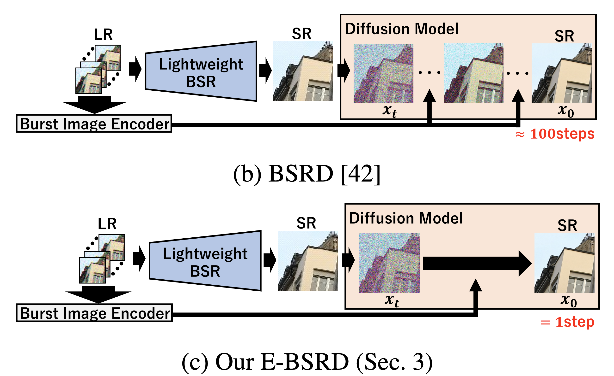

# [E-BSRD(Efficient Burst Super-Resolution with One-step Diffusion)](https://openaccess.thecvf.com/content/CVPR2025W/NTIRE/papers/Kawai_Efficient_Burst_Super-Resolution_with_One-step_Diffusion_CVPRW_2025_paper.pdf)
Welcome! This is the official repository of our paper:  
**"Efficient Burst Super-Resolution with One-step Diffusion"**
- Kento Kawai, Takeru Oba, Kyotaro Tokoro, Kazutoshi Akita, Norimichi Ukita
- Toyota Technological Institute, Japan
> 📢 **Accepted to the CVPR 2025 Workshop on NTIRE (New Trends in Image Restoration and Enhancement)**

## 📄 Abstract
While burst Low-Resolution (LR) images are useful for improving their Super Resolution (SR) image compared to a single LR image, prior burst SR methods are trained in a deterministic manner, which produces a blurry SR image. Since such blurry images are perceptually degraded, we aim to reconstruct sharp and high-fidelity SR images by a diffusion model. **Our method improves the efficiency of the diffusion model with a stochastic sampler with a high-order ODE as well as one-step diffusion using knowledge distillation.** Our experimental results demonstrate that **our method can reduce the runtime to 1.6 % of its baseline** while maintaining the SR quality measured based on image distortion and perceptual quality.

## 🛠️ Installation
- Environment: Python 3.9, CUDA 11
- Create and activate a virtual environment for this repository.
- Following the command below, please install the required packages:
   ~~~bash
   pyenv install 3.9.10
   pyenv virtualenv 3.9.10 E-BSRD
   pip install -r BSRD/requirements.txt
   ~~~
## ⬇️ Download
- Please download Zurich RAW to RGB (synth) and BurstSR (real) datasets.
   ### SyntheticBurst Dataset
   - Training Data
      - Download [Zurich RAW to RGB dataset](http://people.ee.ethz.ch/~ihnatova/pynet.html#dataset) and place it in 'data/synth/zurich-raw-to-rgb'.
   - Evaluation Data
      - Download [syn_burst_val](https://data.vision.ee.ethz.ch/bhatg/syn_burst_val.zip) (or [DBSR](https://github.com/goutamgmb/deep-burst-sr)([dataset](https://drive.google.com/file/d/1DHu3-_tGSc_8Wwwu6sHFaPtmd9ymd0rZ/view))) and place it in './synth/SyntheticBurstVal'.
   - Weights
      - Download [PWC Trained model](https://data.vision.ee.ethz.ch/bhatg/pwcnet-network-default.pth) (or [pwcnet in Burstormer](https://github.com/akshaydudhane16/Burstormer/tree/main/Burst%20Super-resolution/pwcnet) ) and place it in './pwcnet/pwcnet-network-default.pth'.
      - Download [BIPNet Trained model](https://mbzuaiac-my.sharepoint.com/:u:/g/personal/akshay_dudhane_mbzuai_ac_ae/EYlxq0X49fRGiFD3kMxnM6IB7VNtwhd3atNr4oc1b1psbA?e=pLN14I) (or [BIPNet](https://github.com/akshaydudhane16/BIPNet/tree/main)) and place it in './weights/synth/BIPNet.ckpt'.
      - Download [Burstormer Trained model](https://drive.google.com/file/d/1E_6NdmzNjaEpxlrN06SQ9JAyOvGG5wA4/view?usp=sharing) (or [Burstormer](https://github.com/akshaydudhane16/Burstormer/tree/main)) and place it in './weights/synth/Burstormer.ckpt'.
      - Download [E-BSRD-Trained & Distilled Model](https://drive.google.com/file/d/1gePHm-ZnZREBDGMXV5y6GDHdIxVL73h0/view?usp=sharing) and place it in './weights/synth/cm_synth_burst8_sigma003_lpips.pt'.
   ### BurstSR dataset (real data)
   - Training Data
      - Download [BurstSR train and validation set](https://github.com/goutamgmb/NTIRE21_BURSTSR/blob/master/burstsr_links.md).
   - Evaluation Data
      - Download [burstsr_dataset](https://data.vision.ee.ethz.ch/bhatg/BurstSRChallenge/val.zip) (or [DBSR](https://github.com/goutamgmb/deep-burst-sr)([dataset](https://drive.google.com/drive/folders/1A8FytFrYP-y7pZZhfFxVRzEPwcKl-Cp7))).
   - Weights
      - Download [BIPNet Trained model](https://mbzuaiac-my.sharepoint.com/:u:/g/personal/akshay_dudhane_mbzuai_ac_ae/EX4h9sC8zvtPkoHQkvTY8VABxF2C4agXqL9HENW1_7Td9Q?e=XIXchy) (or [BIPNet](https://github.com/akshaydudhane16/BIPNet/tree/main)) and place it in './weights/real/BIPNet.ckpt'.
      - Download [Burstormer Trained model](https://drive.google.com/file/d/1ME1WuRaL3Bv7tBlbcO5hY-pOZ5439E0C/view?usp=sharing) (or [Burstormer](https://github.com/akshaydudhane16/Burstormer/tree/main)) and place it in './weights/real/Burstormer.ckpt'.
      - Download [E-BSRD-Trained & Distilled Model](https://drive.google.com/file/d/1vmr5tNf243CRyYUfB7WEldrX7Ki00kL_/view?usp=sharing) and place it in './weights/real/cm_real_burst8_sigma003_l1.pt'.

## 🚀 Quick Start
   ### SyntheticBurst Dataset
   ~~~bash
   cd consistency_models
   sh sample_CM_synth.sh
   ~~~
   

   
<strong>Command-line options (click to expand)</strong>

   - **`--steps`**   
   Total number of diffusion steps (40 in the paper).

   - **`TS`**   
   Comma-separated indices used to split the diffusion schedule defined by `--steps`  
   (the paper uses `"0,39"`). For a two-step run, set `"0,19,39"`.

   - **`--sigma_max`**   
   Maximum noise level (≈ 0.01 – 0.03); 0.03 gave the best results in our experiments.

   - **`--input_path`**   
   Path to the input dataset.

   - **`--model_path`**   
   Path to the E-BSRD-Trained & Distilled Model.

   - **`--burstormer_weight`**   
   Path to the Burstormer checkpoint for Lightweight BSR model (e.g. `Burstormer_synth.ckpt`).

   - **`--bip_weight`**   
   Path to the BIPNet checkpoint for Lightweight BSR model (e.g. `BIPNet_synth.ckpt`).

   - **`GPU_ID`**   
   ID of the GPU to run inference on.

   

   ### BurstSR dataset (real data)
   ~~~bash
   sh sample_CM_real.sh
   ~~~
   

   
<strong>Command-line options (real-burst inference)</strong>

   - **`--steps`**  
   Total number of diffusion steps (40 in the paper).

   - **`TS`**  
   Comma-separated indices that split the schedule defined by `--steps`
   (the paper uses `"0,39"`).  
   For a two-step run, set `"0,19,39"`, and so on.

   - **`--sigma_max`**  
   Maximum noise level (≈ 0.01 – 0.03); 0.03 gave the best results.

   - **`--input_path`**   
   Path to the input dataset.

   - **`--model_path`**   
   Path to the E-BSRD-Trained & Distilled Model.

   - **`--burstormer_weight`**  
   Path to the Burstormer checkpoint for Lightweight BSR model (e.g. `Burstormer_real.ckpt`).

   - **`--bip_weight`**  
   Path to the BIPNet checkpoint for Lightweight BSR model (e.g. `BIPNet_real.ckpt`).

   - **`GPU_ID`**  
   ID of the GPU to run inference on.

   

## 🙇‍♂️ Acknowledgement
This project is based on [BSRD](https://github.com/placerkyo/BSRD/blob/main/README.md), [Consistency Models](https://github.com/openai/consistency_models) and [EDM](https://github.com/NVlabs/edm). Thanks for the help from the authors.
